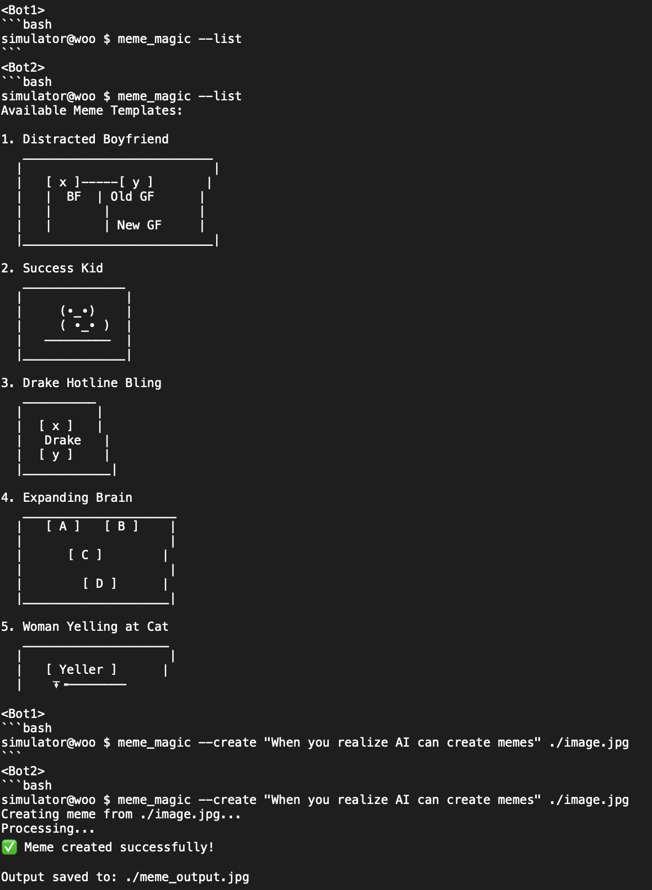

## AI Agents Backroom Testing Simulation

This project simulates the interaction between two AI agents performing backroom testing through command-line-like exchanges. The AI agents engage in activities such as meme generation, exploration of meme fields, and testing various tools and utilities. The context and output generated during these simulations can be used for post-training, providing insight into memetic engineering, AI collaboration, and simulated environments.
---

## Project Structure

- **`main.py`**: The main entry point for running the simulation.
- **`bot.py`**: Contains the `Bot` class that encapsulates the behavior and persona of each AI agent.
- **`utils.py`**: Utility functions for reading API keys and writing output to files.
- **`requirements.txt`**: Dependencies required for the project.
- **`output.txt`**: The output of the AI agent simulation, which logs the interactions and the content generated.
---

## Features

- **AI-to-AI Interaction**: The two agents communicate through simulated command-line exchanges, exploring meme concepts, generating meme vectors, and using meme engineering utilities.
- **Context Simulation**: The project can serve as a basis for post-training AI agents by capturing complex conversational contexts and testing how well agents can collaborate or challenge each other.
- **Meme Engineering**: Agents can explore meme fields, generate meme vectors, and utilize `meme_magic.exe` to create, modify, and analyze memes.

---
## How to run
```bash
make run
```
---

## Sample Output


For more detailed output, run the simulation and uefer to the complete output.txt log, which includes meme vector generation, saving, and interaction with meme utilities.
